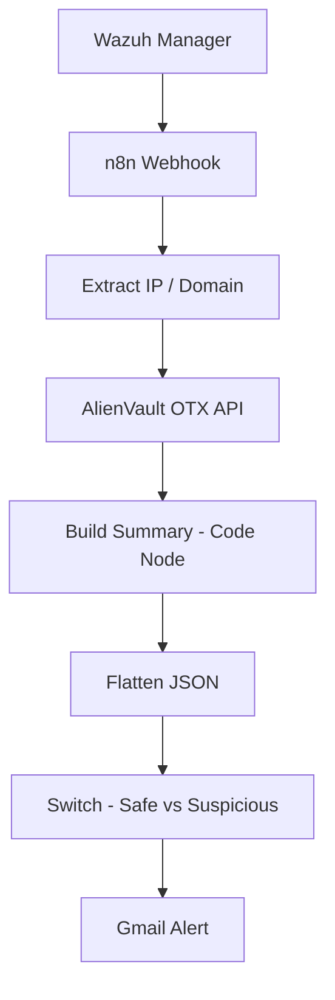
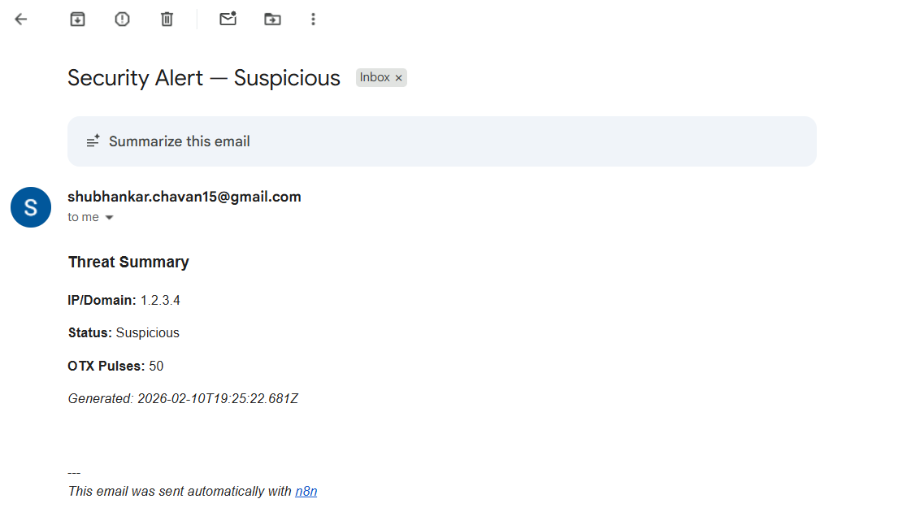
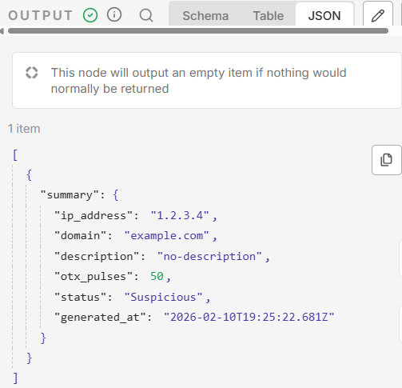
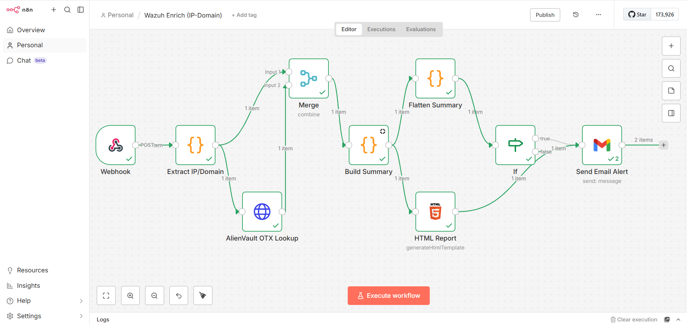

# Wazuh-n8n-Automated-IP-Encrichment
This project automates SOC alert enrichment using **Wazuh**, **n8n**, and **AlienVault OTX**, and sends email notifications via **Gmail** based on threat intelligence results.

---

**When a Wazuh alert is generated:**

**1.** The alert is sent to an n8n webhook.

**2.** The IP/domain is extracted.

**3.** The indicator is enriched using AlienVault OTX.

**4.** A threat status is determined (Safe or Suspicious).

**5.** A formatted email alert is sent via Gmail.

This reduces manual investigation time and automates initial triage.

---

## Workflow Architecture



---

## Technologies Used

- **Wazuh** (Alert generation)

- **n8n** (Workflow automation)

- **AlienVault OTX API** (Threat intelligence enrichment)

- **Gmail Node (n8n)** (Email notification)

---

## Wazuh Configuration

Added integration block inside:
```
/var/ossec/etc/ossec.conf
```
```
<integration>
  <name>custom-n8n</name>
  <hook_url>https://your-n8n-instance/webhook/wazuh-enrich</hook_url>
  <rule_id>100101</rule_id>
  <alert_format>json</alert_format>
</integration>
```

Restart Wazuh:
```
sudo systemctl restart wazuh-manager
```

## Test Payload

Used for testing webhook:
```
{
  "data": {
    "srcip": "1.2.3.4",
    "dns": { "rrname": "example.com" }
  },
  "rule": { "description": "Test Wazuh alert" }
}
```

Sent using:
```
curl -X POST -H "Content-Type: application/json" \
-d @test_payload.json \
https://your-n8n-instance/webhook/wazuh-enrich
```
## Build Summary Logic (Code Node)

The workflow determines status based on OTX pulse count.
```
const item = items[0].json;

const ip = item.ip_address || null;
const domain = item.domain || null;
const description = item.description || "no-description";

const otx = item.otx || {};
const otxPulses = otx.pulse_info?.count ?? 0;

const status = otxPulses > 0 ? "Suspicious" : "Safe";

const summary = {
    ip_address: ip,
    domain: domain,
    description: description,
    otx_pulses: otxPulses,
    status: status,
    generated_at: new Date().toISOString()
};

return [{ json: { summary } }];
```

## Email Alert Logic

After flattening the JSON:

- If ```status = Suspicious``` → Gmail sends alert

- If ```status = Safe``` → Optional safe notification

## Email Subject:
```
Security Alert — {{$json.status}}
```
## Email Body Includes:

- IP Address

- Domain

- OTX Pulse Count

- Status

- Timestamp

---

## Conclusion

This project demonstrates how Wazuh alerts can be transformed into actionable intelligence using n8n workflow automation and AlienVault OTX enrichment.

By integrating:

- **Wazuh (SIEM)**

- **n8n (Workflow Automation)**

- **AlienVault OTX (Threat Intelligence)**

- **Gmail (Alerting System)**

We built a lightweight SOC automation pipeline that:

- Automatically extracts IP/domain indicators from alerts

- Enriches them with external threat intelligence

- Classifies them as **Safe** or **Suspicious**

- Sends structured email notifications for analyst visibility

This automation reduces manual investigation time, improves alert context, and demonstrates how modern SOC teams can leverage workflow automation to enhance threat detection and response.

## Screenshots

### Suspicious Email Alert


### n8n Summary Output


### n8n Wazuh IP Enrichment Workflow

